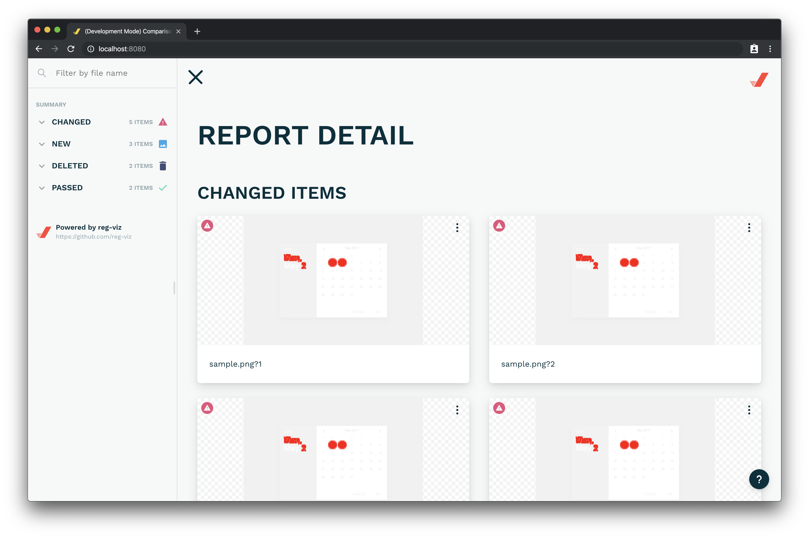
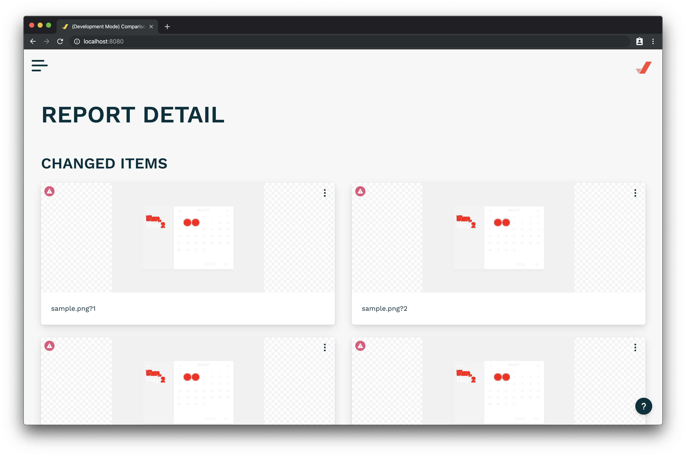
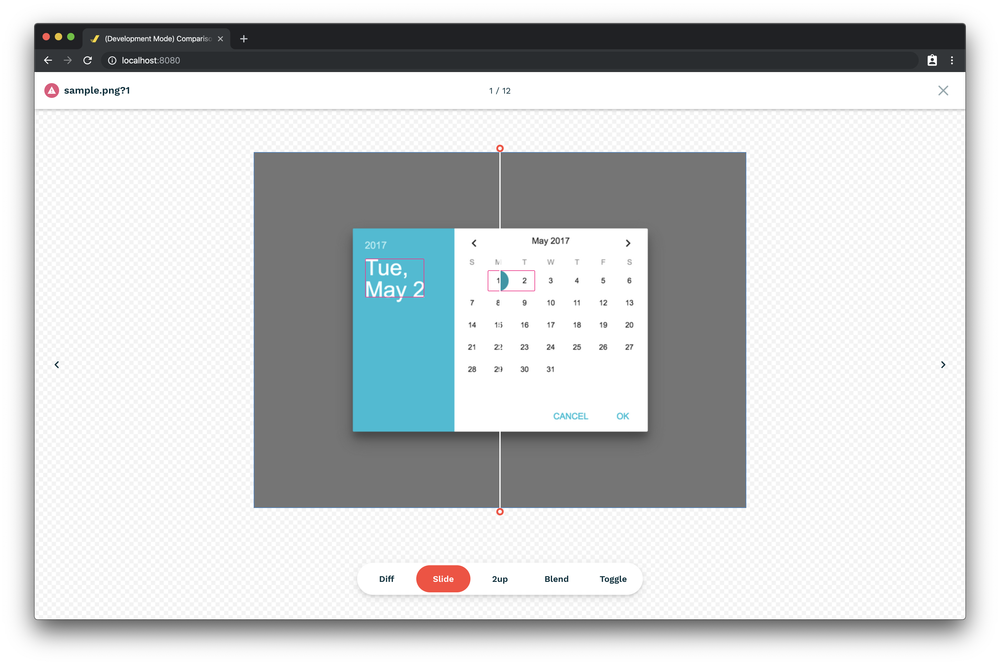

[](https://github.com/reg-viz/reg-cli/actions/workflows/ci.yml)
[](https://www.npmjs.com/package/reg-cli)
[](https://www.npmjs.com/package/reg-cli)

> Visual regression testing CLI with HTML reporter — **Wasm-backed**. Drop-in compatible with classic `reg-cli`'s flags, `reg.json` schema, JUnit XML output, and the `compare()` EventEmitter API used by [reg-suit](https://github.com/reg-viz/reg-suit).

The diff engine is now **Rust → WebAssembly (WASI threads)** instead of pure JS, giving 1.1×–2.9× wall-clock speedups (see [Performance](#performance) below) while keeping the user-facing surface bit-for-bit compatible.

## Table of Contents

- [Installation](#installation)
- [Usage](#usage)
- [Performance](#performance)
- [Architecture](#architecture)
- [Building from source](#building-from-source)
- [Test](#test)
- [Contribute](#contribute)
- [License](#license)

## Installation

### Requirements

 - Node.js v20+

```sh
$ npm i -D @bokuweb/reg-cli-wasm
```

The published bin is still called `reg-cli`, so existing scripts and `reg-suit` integrations keep working without changes.

## Usage

### CLI

```sh
$ reg-cli /path/to/actual-dir /path/to/expected-dir /path/to/diff-dir -R ./report.html
```

####  Options

  * `-U`, `--update` Update expected images. (Copy `actual` images to `expected` images.)
  * `-R`, `--report` Output HTML report to specified path.
  * `-J`, `--json` JSON report path. If omitted: `./reg.json`.
  * `--junit` JUnit XML report path.
  * `-I`, `--ignoreChange` If true, error will not be thrown when image change detected.
  * `-E`, `--extendedErrors` If true, also added/deleted images will throw an error.
  * `-P`, `--urlPrefix` Add prefix to all image src in `reg.json`.
  * `-M`, `--matchingThreshold` Matching threshold, ranges from 0 to 1. Smaller values make the comparison more sensitive. 0 by default. Tunes the YIQ pixel-difference threshold inside the diff lib.
  * `-T`, `--thresholdRate` Rate threshold for detecting change. When the difference ratio of the image is larger than the set rate, change is reported. Applied after `matchingThreshold`. 0 by default.
  * `-S`, `--thresholdPixel` Pixel threshold for detecting change. When the difference pixel count is larger than the set value, change is reported. This value takes precedence over `thresholdRate`. Applied after `matchingThreshold`. 0 by default.
  * `-C`, `--concurrency` How many threads run the per-image diff in parallel. Default: 4. The Wasm version uses Rayon inside the WASI thread pool; below 20 images we fall back to single-threaded to avoid spin-up cost (matches classic reg-cli).
  * `-A`, `--enableAntialias` Enable antialias-tolerant comparison. Off by default.
  * `--diffFormat` Output diff image format: `webp` (default) or `png`. Use `png` for byte-for-byte parity with classic reg-cli's diff images.
  * `-X`, `--additionalDetection` Enable additional difference detection (highly experimental). Select `none` (default) or `client` for the in-browser second-pass detector.
  * `-F`, `--from` Generate report from an existing `reg.json` instead of running the comparison.
  * `-D`, `--diffMessage` Custom diff message printed when a comparison fails.

### HTML report

If `-R` is set, an HTML report is written to the specified path.
https://reg-viz.github.io/reg-cli/





### From JSON

If `-F` is set, only the report is rendered — no image comparison runs.

```sh
$ reg-cli -F ./sample/reg.json -R ./sample/index.html
```

JSON format:

```json
{
    "failedItems": ["sample.png"],
    "newItems": [],
    "deletedItems": [],
    "passedItems": [],
    "expectedItems": ["sample.png"],
    "actualItems": ["sample.png"],
    "diffItems": ["sample.png"],
    "actualDir": "./actual",
    "expectedDir": "./expected",
    "diffDir": "./diff"
}
```

### Library

```js
import { compare } from '@bokuweb/reg-cli-wasm';

const emitter = compare({
  actualDir: './actual',
  expectedDir: './expected',
  diffDir: './diff',
  json: './reg.json',
  report: './report.html',
  threshold: 0,
});

emitter.on('start', () => console.log('start'));
emitter.on('compare', ({ type, path }) => console.log(type, path));
emitter.on('error', (e) => console.error(e));
emitter.on('complete', (data) => {
  console.log(data.failedItems, data.newItems, data.deletedItems, data.passedItems);
});
```

The full option set, event surface, and `CompareOutput` shape match what [`reg-suit`'s `processor.ts`](https://github.com/reg-viz/reg-suit/blob/main/packages/reg-suit-core/src/processor.ts) expects — a regression test in this repo locks that in (`test/library.test.mjs`).

## Performance

Apples-to-apples vs `reg-cli@0.18.16` (last legacy JS release), `--diffFormat png` on both sides, 5 timed runs after 1 warmup, median wall-clock on macOS (Apple Silicon) / Node v20.19.0:

| Workload | JS reg-cli@0.18.16 | @bokuweb/reg-cli-wasm | Wasm speedup |
|---|---:|---:|---:|
| 20 × 1280×720 | 0.56 s | 0.49 s | **1.14×** |
| 100 × 1280×720 | 1.94 s | 1.44 s | **1.35×** |
| 1 × 3840×2160 (4K) | 1.89 s | 0.66 s | **2.86×** |

The gap widens with image size and count: small fixtures are dominated by JS startup, but per-image compute is where the Rust + Rayon path shines. Wasm also has lower run-to-run variance than the JS version (±5% vs ±10% at 4K).

The default `--diffFormat` is **webp**, which is a few % slower than PNG (the encoder is heavier) but produces ~5× smaller diff artefacts. Pass `--diffFormat png` for parity with classic reg-cli.

## Architecture

```
┌─────────────────────────────────────────────────────────────┐
│  Node.js host (src/index.ts, src/cli.ts, src/entry.ts)      │
│                                                             │
│  • CLI argv parsing, EventEmitter API (`compare()`)         │
│  • -U (update mode), -F (re-render from reg.json),          │
│    -X client asset staging, -P urlPrefix application        │
│  • Spawns the WASM entry as a worker_thread, then           │
│    additional thread workers per Rayon thread spawn         │
└──────────────────────────┬──────────────────────────────────┘
                           │  worker_threads + WASI preopens
                           ▼
┌─────────────────────────────────────────────────────────────┐
│  Wasm32-WASIp1-threads bundle (reg.wasm, ~2.5 MB)           │
│  Compiled from `crates/reg_cli` + `crates/reg_core`         │
│                                                             │
│  • clap CLI layer (crates/reg_cli/src/main.rs)              │
│  • Image walker (crates/reg_core/src/dir.rs) — walks the    │
│    actual/expected dirs, intersects, classifies new/del.    │
│  • Per-image diff in a Rayon thread pool                    │
│    (image-diff-rs → pixelmatch-rs port)                     │
│  • Per-file errors are logged + folded into failedItems     │
│    rather than aborting the run (matches classic reg-cli's  │
│    fork-per-image tolerance).                               │
│  • reg.json + JUnit XML + HTML report writers               │
│    (templates: template/template.html, report/assets/*)     │
└─────────────────────────────────────────────────────────────┘
```

Why Wasm instead of native?
- **Portable** — the same `reg.wasm` runs on Linux, macOS, Windows. No prebuilds, no node-gyp.
- **Sandboxed** — file I/O is constrained to WASI preopens declared from the JS host's positional dirs. A misbehaving image can't escape into your filesystem.
- **Threading** — `wasm32-wasip1-threads` exposes `pthread`, so Rayon's `par_iter` works inside the sandbox; image diffs run in parallel across CPU cores.

The `compare-event` channel from Rust to JS is implemented as a stderr-tagged line protocol (`__REG_CLI_EVT__\t{...}`) parsed by `src/progress.ts` and re-emitted on the EventEmitter. That's how live per-file `compare` events fire before `complete`.

## Building from source

`reg.wasm` is committed so most contributors don't need to install the Rust + wasi-sdk toolchain. To rebuild it (and the report-ui assets that `reg_core` embeds via `include_str!`):

```sh
# 1. Build report-ui (clones reg-cli-report-ui at v0.3.0, builds with pnpm)
sh ./scripts/build-ui.sh v0.3.0

# 2. Build reg.wasm (downloads wasi-sdk on first run, then cargo build --release)
bash ./scripts/build-wasm.sh
# or:  pnpm build:wasm

# 3. Bundle everything into dist/
pnpm build
```

One-shot publish prep (the same chain plus `npm pack`):

```sh
pnpm release:prep   # → npm pack --dry-run
pnpm release:pack   # → writes the .tgz
```

`scripts/build-wasm.sh` works on macOS (arm64 / x86_64) and Linux (x86_64 / arm64). It auto-installs the `wasm32-wasip1-threads` rustup target if `rustup` is available.

## Test

```sh
$ pnpm test                              # → 50 node:test cases (CLI + library)
$ cargo test -p reg_core --lib --locked  # → 12 Rust unit tests (Linux / macOS)
```

CI runs both the JS tests and `cargo test` on Ubuntu and macOS. **Windows is not in the matrix:** Node's built-in WASI runtime returns `EINVAL` when the wasm bin writes to preopened relative paths (`reg.json` / `report.html` / `diff/*.png`) — a bug in Node's WASI path translation, not in `reg.wasm` itself. Until that's fixed upstream, Windows users should run reg-cli under WSL or git-bash; the wasm bin itself is OS-independent.

## Contribute

PRs welcome.

## License

The MIT License (MIT)

Copyright (c) 2017 bokuweb

Permission is hereby granted, free of charge, to any person obtaining a copy of this software and associated documentation files (the "Software"), to deal in the Software without restriction, including without limitation the rights to use, copy, modify, merge, publish, distribute, sublicense, and/or sell copies of the Software, and to permit persons to whom the Software is furnished to do so, subject to the following conditions:

The above copyright notice and this permission notice shall be included in all copies or substantial portions of the Software.

THE SOFTWARE IS PROVIDED "AS IS", WITHOUT WARRANTY OF ANY KIND, EXPRESS OR IMPLIED, INCLUDING BUT NOT LIMITED TO THE WARRANTIES OF MERCHANTABILITY, FITNESS FOR A PARTICULAR PURPOSE AND NONINFRINGEMENT. IN NO EVENT SHALL THE AUTHORS OR COPYRIGHT HOLDERS BE LIABLE FOR ANY CLAIM, DAMAGES OR OTHER LIABILITY, WHETHER IN AN ACTION OF CONTRACT, TORT OR OTHERWISE, ARISING FROM, OUT OF OR IN CONNECTION WITH THE SOFTWARE OR THE USE OR OTHER DEALINGS IN THE SOFTWARE.


